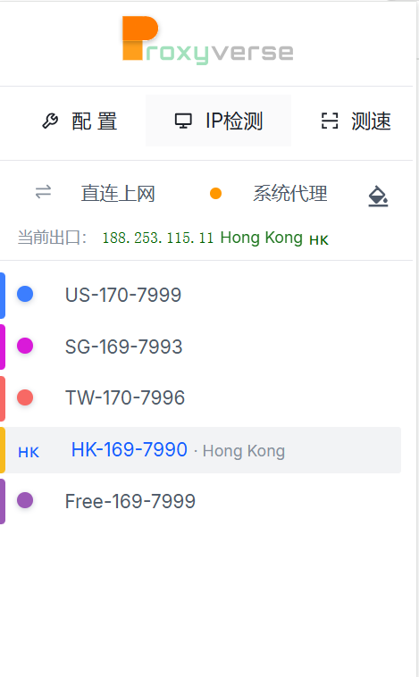
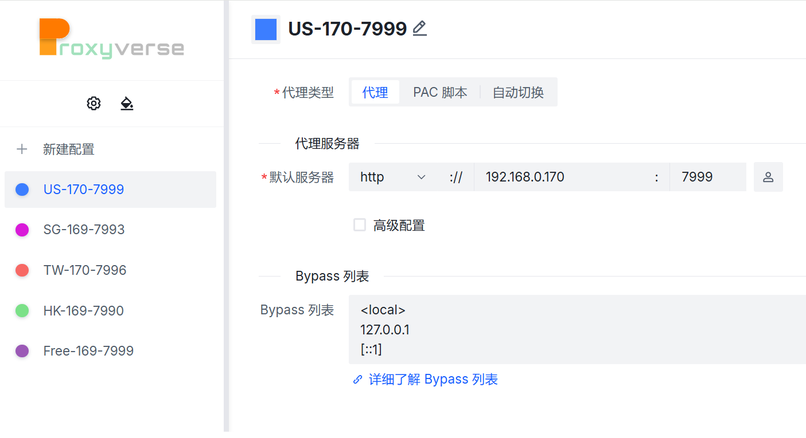
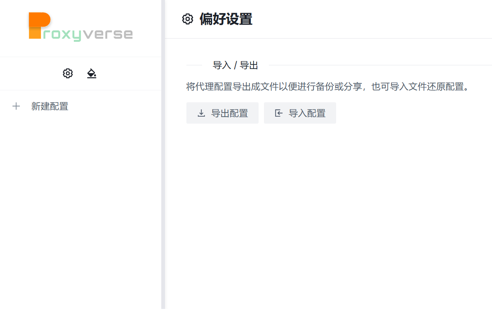

This code is adapted from https://github.com/bytevet/proxyverse/.
Thank you for this..

ProxyversePlus is a simple tool to help you switch between different proxy profiles. Proxyverse is an alternative extension to Proxy SwitchyOmega.

- [x] Basic profile switch support
- [x] Support proxy authentication
- [x] Support auto switch rules

此代码改编自 https://github.com/bytevet/proxyverse/。
谢谢你。

ProxyversePlus 是一款简单易用的工具，可帮助您在不同的代理配置文件之间切换。Proxyverse 是 Proxy SwitchyOmega 的一个替代扩展程序。

- [x] 基本配置文件切换支持
- [x] 支持代理身份验证
- [x] 支持自动切换规则

此分支版本专注于隐私保护、用户界面改进以及本地运行
- [x] 所有追踪、遥测和远程报告功能均已完全移除。
- [x] 已移除 Sentry Vue SDK、Sentry Vite 插件及所有相关代码
- [x] 任何用户数据或配置都不会上传到任何地方。
- [x] 重构弹出窗口界面（更简洁、更紧凑）
- [x] 代理模式更改时自动刷新
- [x] 修改了插件显示的图标

## 主界面 main

## 新建代理 add proxy

## 导入 / 导出 in/outport

